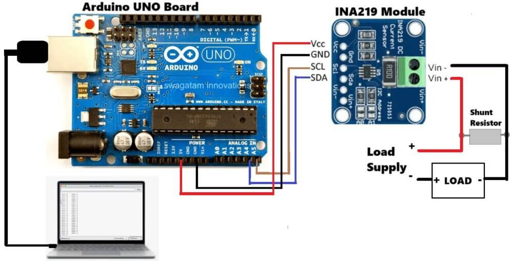

# Arduino + INA219 — Energy Monitoring with Prometheus & Grafana

Monitors the power consumption of a Raspberry Pi (or any DC load) using an **Arduino UNO** and an **INA219** current/power sensor. Metrics are exposed as a Prometheus endpoint and visualised in Grafana.

## Hardware Wiring

The INA219 communicates with the Arduino via I2C. The shunt resistor is placed **in series** with the load so the sensor can measure current flow.



| INA219 Pin | Arduino Pin |
|---|---|
| VCC | 5V |
| GND | GND |
| SCL | A5 (SCL) |
| SDA | A4 (SDA) |
| Vin+ | Load supply + |
| Vin− | Load (Raspberry Pi) + |

> The shunt resistor sits between **Vin−** and the positive terminal of the load. The power supply negative goes directly to the load negative.

## Prerequisites

- Docker and Docker Compose
- Arduino UNO with INA219 module wired as above
- Arduino IDE (to flash `ina219_without_ethernet/ina219_without_ethernet.ino`)
- Local network access to the Arduino

## Project Structure

```
arduino/
├── assets/
│   └── ina_diagram.jpg               # Wiring diagram
├── grafana/
│   ├── dashboards/
│   │   └── arduino-energy-dashboard.json
│   └── provisioning/
│       ├── datasources/
│       │   └── datasource.yml
│       └── dashboards/
│           └── dashboard.yml
├── ina219_without_ethernet/
│   └── ina219_without_ethernet.ino   # Arduino sketch
├── prometheus/
│   ├── prometheus.yml
│   └── alerts.yml
├── docker-compose.yaml
├── main.py                           # Python bridge: reads serial → exposes /metrics
└── README.md
```

## Setup

### 1. Flash the Arduino

Open `ina219_without_ethernet/ina219_without_ethernet.ino` in the Arduino IDE and upload it to your Arduino UNO.

### 2. Configure the Prometheus target

Edit `prometheus/prometheus.yml` and set the correct IP for your machine running `main.py`:

```yaml
scrape_configs:
  - job_name: 'arduino_energia'
    static_configs:
      - targets: ['192.168.0.50:8080']  # <- change to your host IP
```

To find the Arduino serial port, check the Arduino IDE or run `ls /dev/ttyUSB*` (Linux) / Device Manager (Windows).

### 3. Start the stack

```bash
docker-compose up -d

# Check running containers
docker-compose ps

# Follow logs
docker-compose logs -f
```

### 4. Fix permissions (Linux/macOS only)

```bash
sudo chown -R 65534:65534 prometheus/
sudo chown -R 472:472 grafana/
```

## Accessing the Services

| Service | URL | Credentials |
|---|---|---|
| Grafana | http://localhost:3000 | admin / admin |
| Prometheus | http://localhost:9090 | — |

### Verify Prometheus target

Go to http://localhost:9090 → **Status → Targets** — the `arduino_energia` target should show **UP**.

### Open the Grafana dashboard

1. Log in at http://localhost:3000
2. Go to **Dashboards** and open **Arduino Energy Monitor - INA219**

If the dashboard is not auto-provisioned, import it manually:
**+ → Import dashboard → Upload JSON file** → select `grafana/dashboards/arduino-energy-dashboard.json`.

## Useful PromQL Queries

```promql
# Instantaneous current (A)
energia_corrente

# Instantaneous power (W)
energia_potencia

# Instantaneous voltage (V)
energia_tensao

# Average current over the last 5 minutes
avg_over_time(energia_corrente[5m])

# Peak power in the last hour
max_over_time(energia_potencia[1h])

# Estimated total consumption (Wh)
sum(energia_potencia) * 5 / 3600

# Rate of current change
rate(energia_corrente[1m])
```

## Stopping the Stack

```bash
# Stop containers
docker-compose stop

# Stop and remove containers
docker-compose down

# Remove containers and volumes (deletes all stored data)
docker-compose down -v
```

## Updating Configuration

After changing any config file, restart the affected service:

```bash
docker-compose restart
# or fully recreate
docker-compose up -d --force-recreate
```

## Troubleshooting

**Arduino not showing in Prometheus targets**
```bash
ping 192.168.0.50
curl http://192.168.0.50:8080
docker-compose restart prometheus
```

**Grafana shows no data**
1. Go to http://localhost:9090 → Graph → run `energia_corrente`
2. In Grafana go to **Configuration → Data Sources → Prometheus → Test**

**Permission denied errors (Linux/macOS)**
```bash
sudo chown -R $(id -u):$(id -g) .
sudo chmod -R 755 prometheus/ grafana/
```
